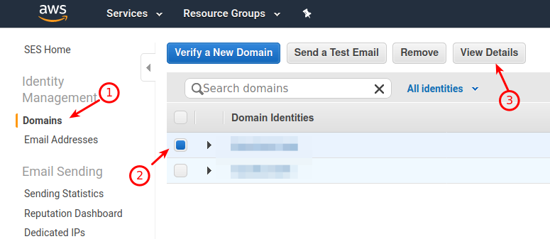
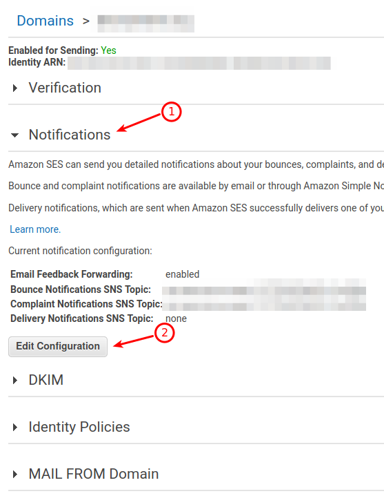

# Amazon SES Specific Configuration
## Settings - For CiviMail for Amazon SES

Log onto AWS. Navigate to the Service **SES** and then to **SMTP Settings**, here you will find the server name and port as well as be able to create SMTP Credentials.

Make sure your CiviCRM Outbound Mail settings (**CiviCRM->Administer menu -> System Settings -> Outbound Mail**) are configured to match the settings in your AWS SES account.

You should also be sure that your default mail account which is used for bounce processing (**CiviCRM->Administer menu->Mail Accounts**) is configured and uses a domain that is verified by SES for your account. Similarly, check that your "From" email address (**CiviCRM->Administer CiviCRM->From Email Address Options**) is configured and approved in SES.

## Settings in Amazon SES

In SES you will need to:

+ configure SMTP Credentials,
+ verify domains and email addresses.
+ Set up a configuration set by navigating to **SES Home -> Configuration Sets -> Create Configuration Set**
  - for destination {select a destination type} select **SNS**
  - Configure the SNS destination  
    - For Event Types check **Bounce** and **Complaint**
    - For Topic, create a new topic
+ Configure identities to use SNS
  - Go to SES Home -> Identity Management -> Domains (this works the same for verified email addresses) (screenshot 1 step 1).
  - Tick the checkbox to the left of one of your domain identities (screenshot 1 step 2).
  - Click the **View Details** button at the top of your screen (screenshot 1 step 3).
  - Click the **Notifications** header (screenshot 2 step 1).
  - Click **Edit Configuration** (screenshot 2 step 2).
  - Under *SNS Topic Configuration*, set **Bounces** and **Complaints** to your new SNS topic.
  - Optionally, set *Email Feedback Forwarding* to **Disabled** if you don't want senders to receive bounce messages.
  - Click **Save Config**.

  

  

## Settings in SNS
Once you have set up a configuration Set you will need to go to SNS home and configure SNS to process the topic.

* Go to **SNS Home -> Topics** and click on the name of the topic you created above.
* Click the **Create Subscription** button.

On the *Create Subscription* screen the Topic ARN should be populated.  Set the Protocol to **HTTPS**.  The endpoint should be the URL in the green box on the settings page for this extension (somethng like: http://{yourDomain}/civicrm?page=CiviCRM&q=civicrm/airmail/webhook&reset=1&secretcode={secretCode}) then click "Create Subscription"

At first the Subscription will show up as pendingConfirmation, you may need to wait a minute and then refresh the page before it confirms... SNS sends a subscribe URL to your site which this extension responds to.. that process takes a minute or two.

## Useful resources
+ Amazon's Testing Email Addresses: http://docs.aws.amazon.com/ses/latest/DeveloperGuide/mailbox-simulator.html
+ Amazon Documentation on SNS messages to HTTP: http://docs.aws.amazon.com/sns/latest/dg/SendMessageToHttp.html
