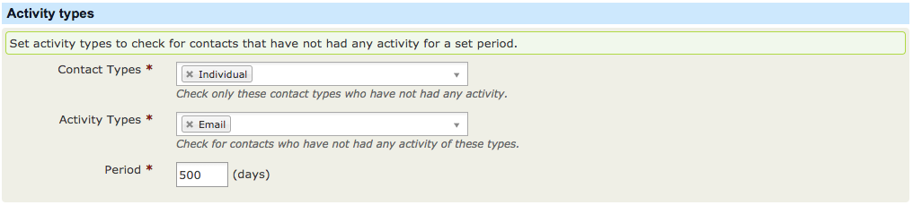
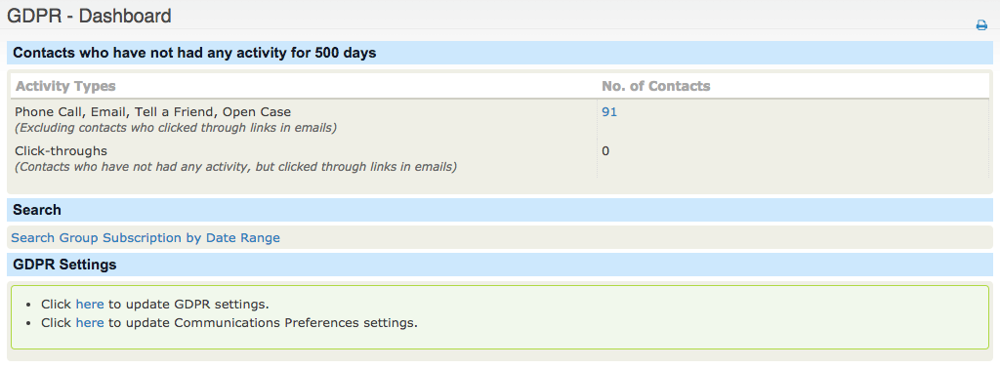
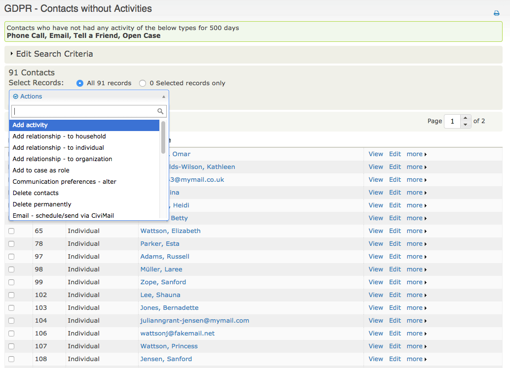

# Inactive Contacts

As part of any regular housekeeping and ensuring that data is not kept beyond its agreed periods, old inactive supporters should be removed. This reduces the likelyhood of the organisation contacting someone against their preferences or their best interests.

## Custom Search

Part of the GDPR extension introduces a custom search, which identifies supporters who have not had specific activities for a period of time.

These settings can be controlled within the GDPR setup

* **Contact Types** - The contact types that should be included in the search, for example it may not be necessary to identify organisations without activity.
* **Activity Types** - A list of the activities that the organisation deems to be engagement and therefore exclude any contacts who have had the activity recorded on their record.
* **Period** - Period of time to check i.e. setting of 500 would expect the custom search to check anyone who has not had any of the above activities within the last 500 days. In this way we can search back any number of years, identifying the most toxic data first before moving to more recent contacts.

## Actions

The GDPR dashboard will show the contacts who meet the criteria that have been configured.

Clicking on the number will then present the contacts who have been identified, from the results you can perform an action, for example add to a group for a final communication or delete the contacts if they are invalid.

