# Communication Prefrences

## Consent {:#Consent}
One of the biggest talking points around GDPR has been the tightening up of the definition of consent. This now reads:

> any freely given, specific, informed and unambiguous indication of the Data Subject's wishes by which he or she, by a statement or a clear affirmative action, signifies agreement.....

GDPR also says that in any statement the request for consent must be

> presented in a manner which is clearly distinguishable from other matters....using clear and plain language

So no automatic opting in during competitions or incentives and no longer implicitly gaining consent. Consent must now be granular.

Another clarficiation is any processing which is based on consent must be backed up by the ability of the processor to prove you have consent. There is no guidance yet on what this means, but as a minimum one might suppose that you would need to keep a record of when and how (e.g. by ticking a box) people consented and what the have consented to (ideally by reference to the full statement on the data capture form, for example).

## Communication Preferences configuration {:#Configuration}

In order to help organisations adhere to the regulations, the CiviCRM GDPR extension provides a combined communication page.

The following features are provided by the extension

* Configurable Communication Preference Page
* Activity generated when a user submits
* Combine groups and opt out into a single form
* Data Policy agreement tick box and Activity

In order to configure the communication preferences settings carry out the following;

1. **Contacts > GDPR Dashboard**
1. **Click the communication preferences link**

### General {:##Configuration}

Once clicked, you'll be presented with the communications preferences configuration page.

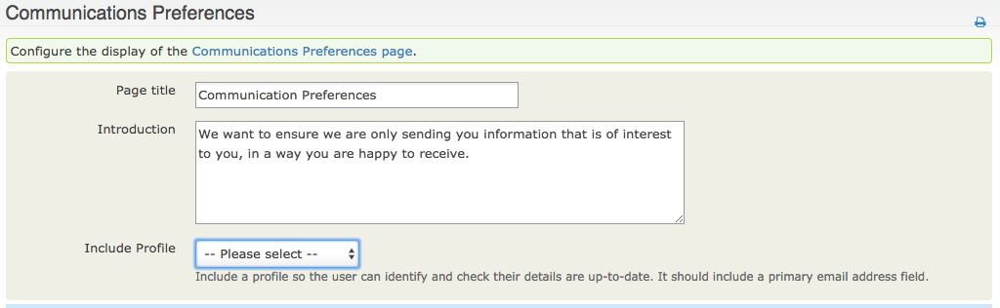

* **Page title** The page title and form title to be displayed when a supporter visits the communication preferences page
* **Introduction** Text to be displayed at the top of the communication preferences page
* **Include Profile** Data to be verified when the supporter is presented with the communication preferences page.

For example, the following settings

Would result in the Communications Preferences page displaying as follows

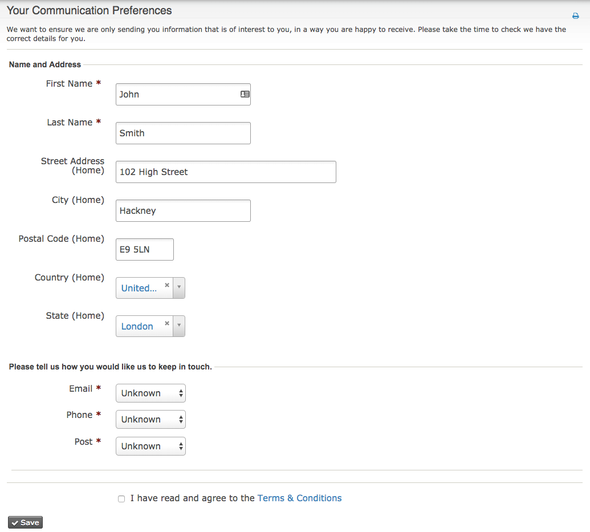

### Communicatin Channels

Supporters also need the ability to confirm which channels they are happy to be communicated via i.e. a support may chose to indicate they never wish to be contacted via phone or via email. The communication preferences configuration allows you to control which options are available to supporters.

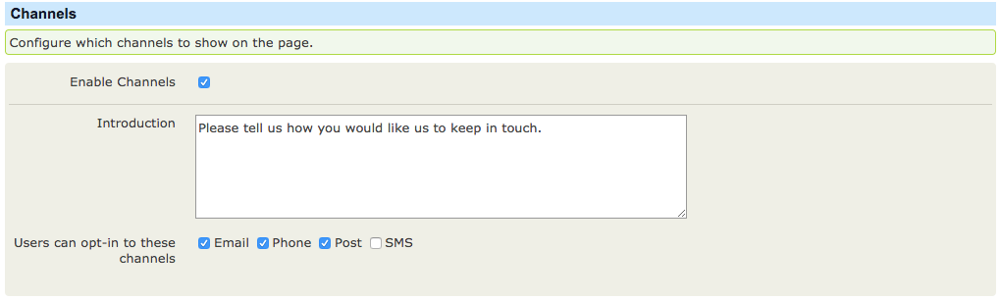

* **Enable Channels** Controls whether channels should be avilable for selection by supporters
* **Introduction** Text to be displayed at the top of the channels section
* **Users can opt-in to these channels** The channel list to be exposed to supporters. Note that additional options can be made available by navigating to the **Preferred Communication Method Options** screen within your CiviCRM install.

On enabling the channels the communication preferences page will reflect the options made available, as can be seen in the "Please tell us how you would like us to keep in touch." Section.

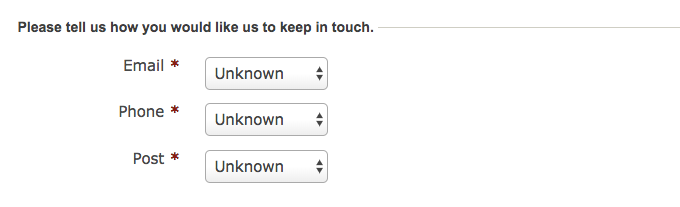

!!! note
    The channels chosen by a supporter will influence they groups they can opt into. For example if a supporter decides they do not wish to be emailed then a group which is email only will not be available for the supporter to opt into.

### Group Subscription

Under the GDPR regulations its imperative that supporters can easily and without confusion administer their selections, including the types of communication they are included in. This process is normally controlled by Groups in CiviCRM, with users opting into and out of groups during email campaigns. The GDPR extension brings the groups into the communication preferences page, allowing supporters to control all of their options in a single visit.

On enabling the **Allow users to opt-in to mailing groups.** checkbox, all groups that are set to be **Publicly Accessible** will be listed.

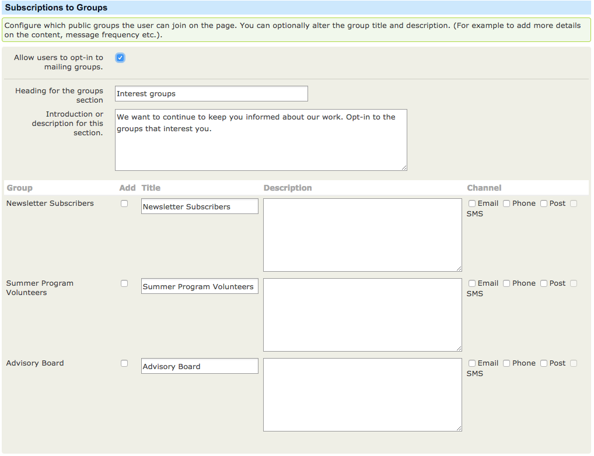

!!! note
    The **Email** channel is a reflection of the no bulk emails setting in CiviCRM. Therefore if a supporter opts out of email their **No Bulk Emails** communication preference will be activated. The reason for this approach is that transactional emails, such as event registration confirmation or donation receipts, will still be sent, it is only mass communications that the supporter is opting out of.

To check whether your groups are Publicly Accessible:

* Navigate to: Contacts > Manage Groups
* Search for your mailing group
* Click the settings for that group
* Change the **Visibility** to Public Pages and save

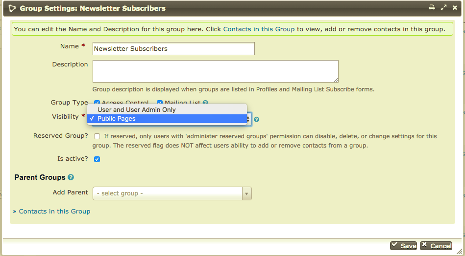

Search Each group has the following options

* **Group** The internal CiviCRM group name
* **Add** Determines if the group should be included in the communications preferences page
* **Title** The title of the group to be displayed to the supporter completing the communication preferences page, useful if the internal names of groups are not easily understood.
* **Description** The public facing description to be displayed along side the Title.
* **Channel** Clarifies the channels that a group is proposing for communication. This setting will impact the groups available for a supporter based on their communication channel selections.

!!! note
    Part of the GDPR regulation includes ensuring supporters are clear about the groups they are opting into. Its therefore advisable to include the type of information, the frequency and format of the communications that will be sent as a result of the supporter opting into the group.

Using the options we're able to produce a communications preferences page as below

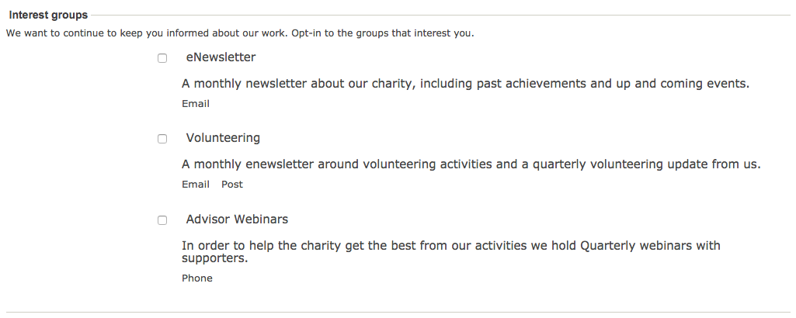

An example of the warning displayed to a supporter if they opt out of a communication channel needed by a group they are opting into can be seen below

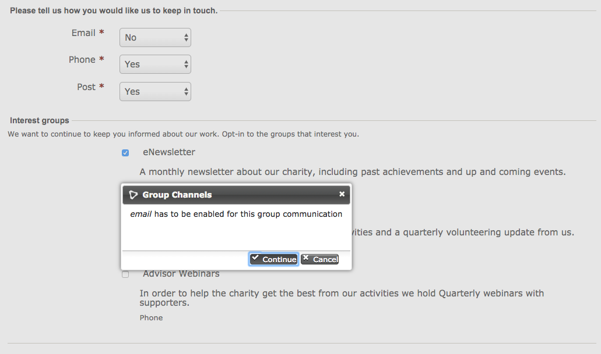

### Thank You Page

The completion section of the configuration allows the organisation to control the journey on submmission of the communication preferences by a supporter.

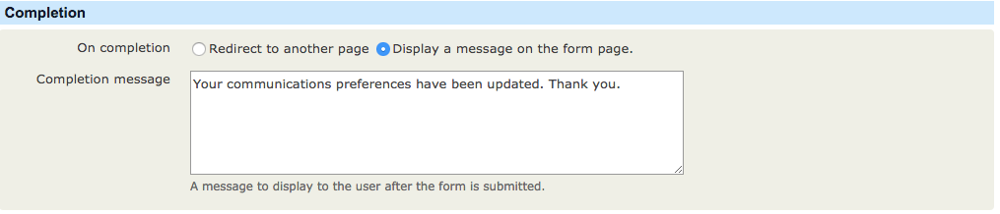

* **On Completion** Use this setting to either direct the suppoerter to a custom page or present the pre configured message
* **Completion message** Message to be displayed if a redirect is not in place

### Page Submission

On submission of the page, activities and updates to the GDPR tab will be reflected on each supporters contact record.

Firstly any channels the supporter opts out of will be reflected in the communication preferences, for example opting out of phone would be reflected as follows

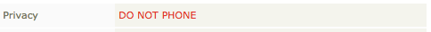

An activity will be generated each time the communication preferences are updated by a supporter, including an activity to reflect the acceptance of the data policy

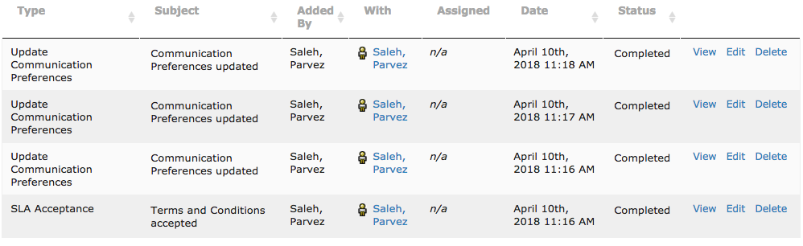

The groups tab will be updated to reflect communications the supporter has opted into.

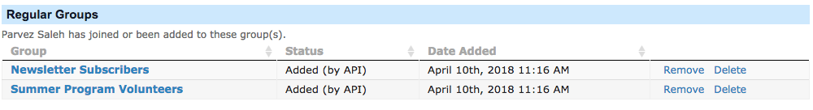

Finally the GDPR tab against the supporter will also reflect all the changes, including the last submission dates.

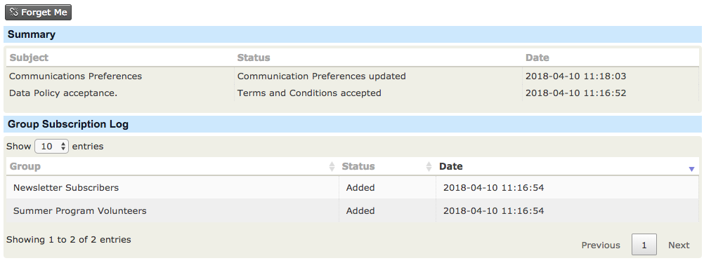

### Tokens

Four new tokens have been introduced, to allow you to request updates from supporters. The tokens will automatically add the checksum to the links supporters receive, so that they do not need to login in order to update their communication preferences. We would expect most users of the GDPR extension to replace the traditional opt out and unsubscribe links with this single communication preferences page.

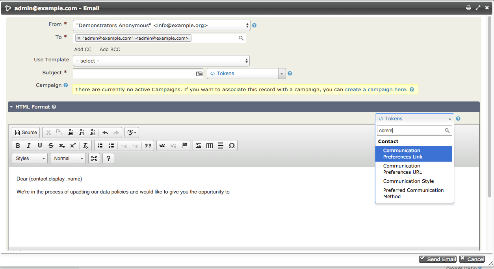

* **Communicaion Preferences Link** This token creates a clickable link the in template, with the description takens from the settings, including the checksum of the contact being communicated with.
* **Communicaion Preferences URL** This token creates a plain URL template including the checksum of the contact being communicated with. For example this token could then be used for clickable images within outbound communications.

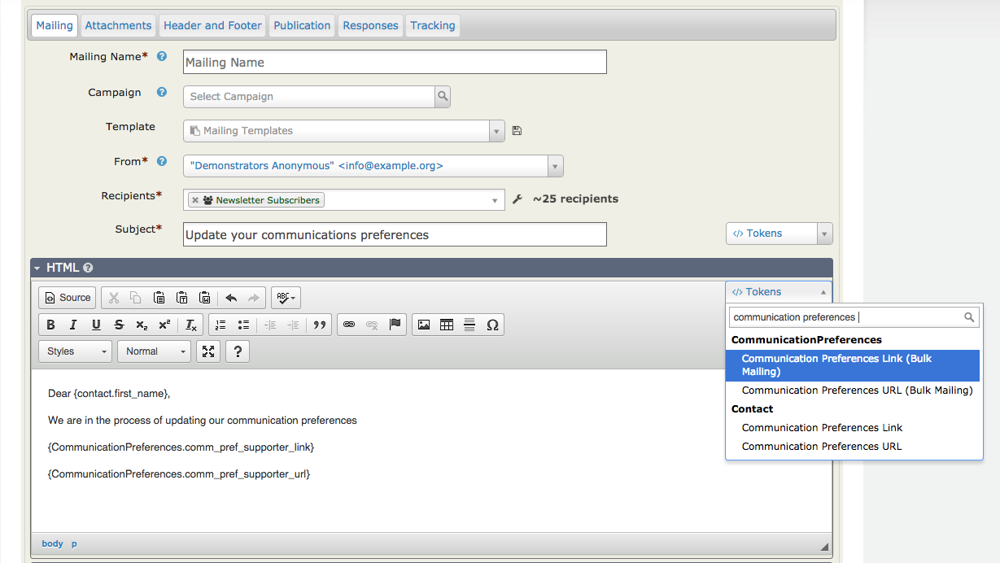

* **Communicaion Preferences Link (Bulk Mailing)** This token creates a clickable link the in a Bulk Mailing template, with the description takens from the settings, including the checksum of the contact being communicated with.
* **Communicaion Preferences URL (Bulk Mailing)** This token creates a plain URL template including the checksum of the contact being communicated with. For example this token could then be used for clickable images within outbound communications.

