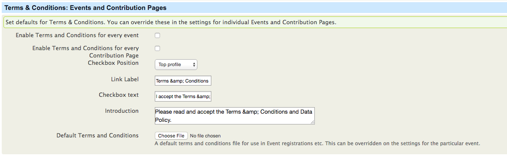

# Configuration

## Steps

Use the following steps to configure GDPR.

1. Navigatge to the Contacts menu > GDPR Dashboard > GDPR Settings

2. Data Protection Officer
Select your Data Protection Officer from your contact database, or add a new contact if they don't already exist.

3. Activity Types
Set the activity types you want to check where contacts that have not had any activity for a set period of time. For example you may want to look for all contacts that haven’t been sent a bulk email, paid a contribution or registered for an event in the last 100 days.

4. Forget me
This is where you can choose the title you want to give contacts that have been made anonymous. Some examples to use might be, Anon, Anonymous, Forgotton

5. Data policy
This is where you can upload your Data Policy. These settings relate to sitewise agreements such as Data Policy or Terms and Conditions. These settings will apply in the Communications Preferences page and when Terms and Conditions are used with Events.

6. Terms & Conditions: Events and Contribution Pages
This is where you can upload your Terms & Conditions. You can set default files for your Terms & Conditions. You can override these in the settings for individual Events and Contribution Pages.

