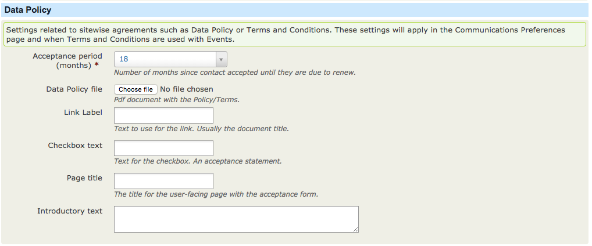

# Data Policy

## Transparency

It has always been a key element of Data Protection that people should know enough about what is being done with their data. **'Enough' is now much broader under GDPR**. The implication of the changes are that the key points, which you should determine with your GDPR consultant, have to be presented to supporters on the data capture form or verbally, while the full details are put in an accessible and understandable privacy policy or statement.

In order to record the acceptance of the data policy, including a copy of the policy at the time of acceptance, the GDPR extension includes a set of functions.

## Settings

Under the general settings within the GDPR extension there is a section dedicated to your organisations **Data Policy**

* **Acceptance period (months)** The period of time that the system will allow before a reconfirmation is requested from the supporter.
* **Data Policy file** The Data Policy statement for your organisation. A version history is kept if updated versions of the document are uploaded.
* **Link Label** The label to be shown on supporter facing pages for the link to the actual document
* **Checkbox text** The text to be shown alongside the acceptance checkbox
* **Page title** The Title of the data policy page if used standalone
* **Introductory text** Text on the page if used stand alone

An example of the settings can be seen on the communication preference page, as below

On submission an Activity is recorded against the supporter with a link to a copy of the data policy at the time of acceptance.

On subsequent visits to the communications preferences page the supporter will not be prompted to accept the data policy, unless

* The validity period set in the extension has been exceed
* A new version of the data policy has been uploaded and the **This is a new version of the document.** checkbox was ticked, indicating a change to the terms which require acceptance from the supporter.

