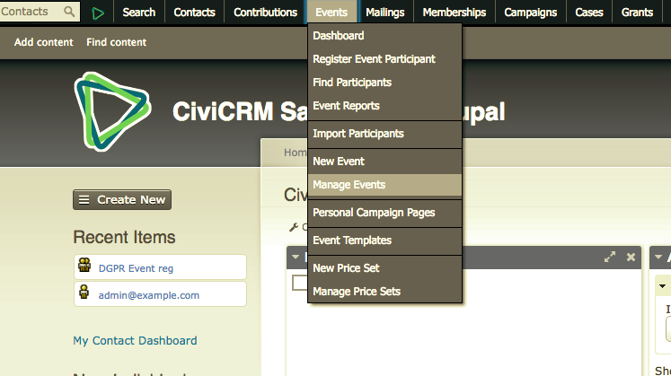
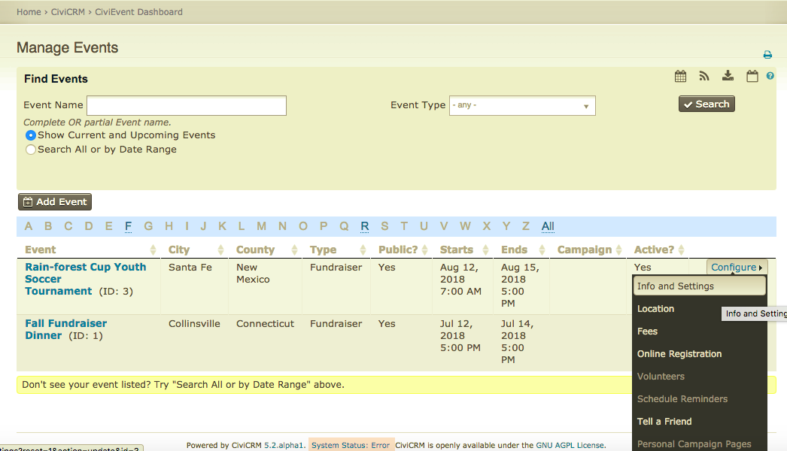
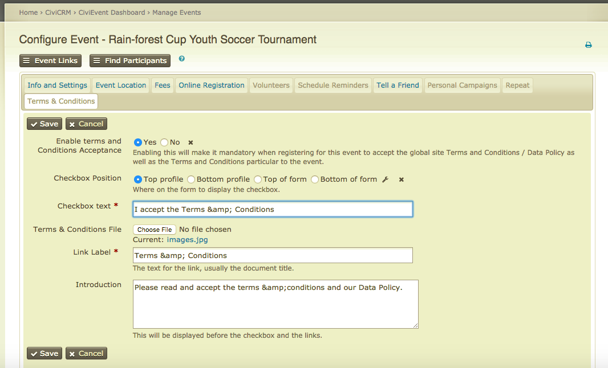
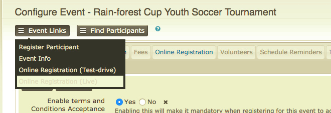
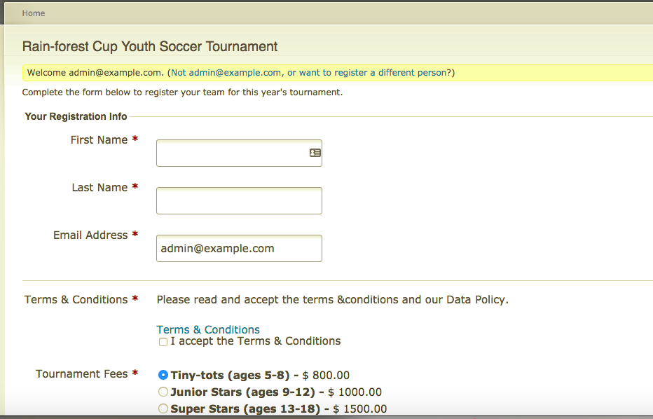

# Events terms & conditions configuration

- Navigate to Manage Events pages and select your event

- Go to the Configuration settings for your event

- Under the event configuration, there is now a Terms & conditions tab

- Complete the settings for where you want the t&c's checkbox located and complete the title you wouldlike to appear with a description if any
- Under the Event Links button, navigate to hte Online Registration page to view the settings

- The online live contribution page now displays the event terms & conditions

