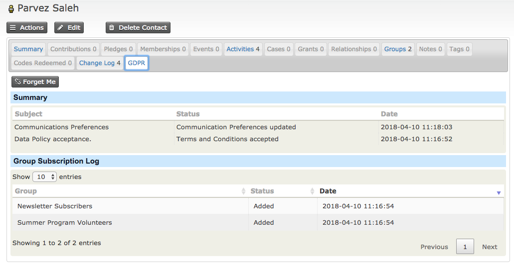

# Erasure (“Right to be forgotten”)

Under the GDPR regulations the Data Subject (supporter) can tell you to erase their information and you must do so unless you have a good reason (from among the options set out in GDPR) to retain it.

Some of the examples include financial history including any tax related information.

In order to allow a contact to be forgotten within CiviCRM, without comprising key meta data around the supporter, we have introduced a new button under the GDPR tab on each contact.

On pressing the button for a contact, the following actions will take place

* Anonymize contact **Last Name** will be amended to the name set in the GDPR settings
* Remove the contact's email/address/phone/IM/website
* Cancel all active memberships and update to 'GDPR Cancelled' status using staus override.
* An activity will be created against the contact to show that they had been anonomised
* Optionally an email with the contact ID will be sent to the DPO if the settings have been enabled

